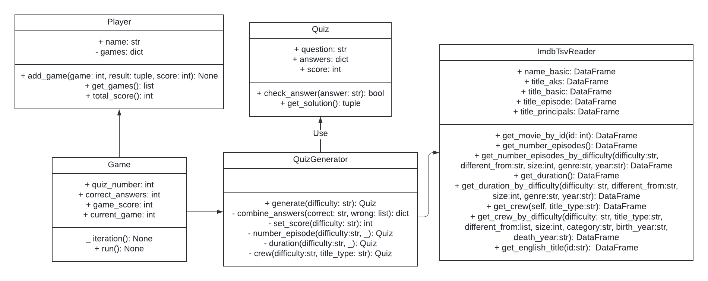

# Cinequiz

## 1. La risposta giusta

Lo scopo del progetto è creare automaticamente quiz a scelta multipla relativi a film, sfruttando i dati di IMDb. Ogni quiz deve essere composto da una domanda e quattro possibili risposte, di cui solo
una corretta. Il programma che genera quiz deve inoltre implementare un criterio per generare le
possibili risposte proporzionale alla difficoltà del quiz desiderato. Il programma deve inoltre
consentire ad un giocatore umano di rispondere al quiz e deve misurare la sua prestazione con un
punteggio che tenga conto della difficoltà di ogni singola domanda. \
I dati IMDb possono essere acquisiti tramite API specifiche (come Cinemagoer) o set di dati esistenti,
come IMDb Dataset.

### Dataset utilizzato

Il [dataset](https://developer.imdb.com/non-commercial-datasets/) utilizzato è un subset dei dati IMDb messi a disposizione per uso personale e non ad uso commerciale.
Il dataset è stato modificato e ridotto per renderlo utilizzabile, i file sono presenti al percorso 'cinequiz/data/imdb/':

- name.basics.tsv
- title.akas.tsv
- title.basics.tsv
- title.episode.tsv
- title.principals.tsv

### UML class

### Logica di selezione dei quiz
